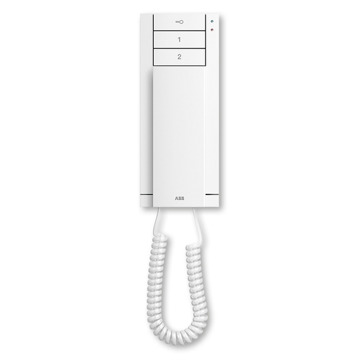
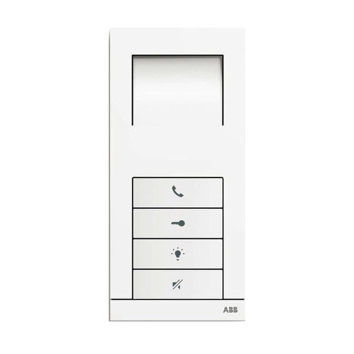
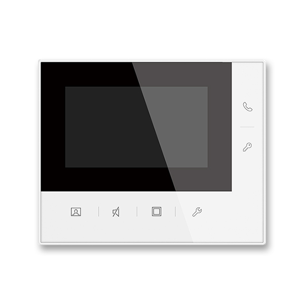
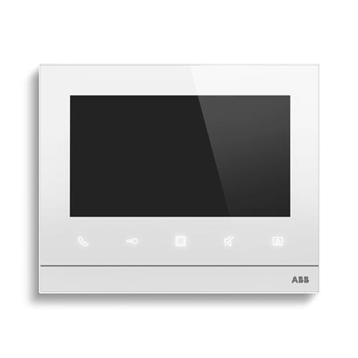

# Telefonní varianty pro přístupový systém

## Stav dokumentu

Pracovní podklad k první agendě přístupového systému. Údaje vycházejí z podkladového screenshotu a z produktových stránek ABB dodaných dne 2026-05-08.

Obrázky jsou uloženy lokálně pro pracovní analýzu. Před veřejným publikováním na webu SVJ je vhodné ověřit, zda lze produktové obrázky ABB použít tímto způsobem, případně použít odkazy nebo podklady výslovně poskytnuté dodavatelem.

## Přehled variant

| Kód varianty | Název pro formulář | Doplatek | Rozměry | Objednací číslo | Typové číslo | Obrázek | Zdroj |
|---|---|---:|---|---|---|---|---|
| `audio-sluchatko` | Základní audiotelefon | 0 Kč | 198 x 81 x 43 mm | `2TMA210050W0001` | `M22002-W-02` | [audio-sluchatko.jpg](assets/telefony/audio-sluchatko.jpg) | [ABB produkt](https://nizke-napeti.cz.abb.com/telefon-domovni-se-sluchatkem-17910/telefon-domovni-se-sluchatkem-2tma210050w0001) |
| `audio-handsfree` | Handsfree audiotelefon | 1 667 Kč | 175 x 81 x 22 mm | `2TMA210050W0016` | `83210 AP-624-500-02` | [audio-handsfree.jpg](assets/telefony/audio-handsfree.jpg) | [ABB produkt](https://nizke-napeti.cz.abb.com/telefon-domovni-hands-free-nastenny-17911/telefon-domovni-hands-free-2tma210050w0016) |
| `videotelefon-43` | Videotelefon, displej 4,3" | 4 146 Kč | 124 x 152 x 22,5 mm | `2TMA220051W0004` | `M22481-W` | [videotelefon-43.jpg](assets/telefony/videotelefon-43.jpg) | [ABB produkt](https://nizke-napeti.cz.abb.com/videotelefon-welcome-midi-4-3-20650/videotelefon-domovni-4-3-nastenny-2tma220051w0004) |
| `videotelefon-7` | Videotelefon, displej 7" | 5 057 Kč | 162,3 x 198,5 x 17 mm | `2TMA220050W0015` | `M22381-W-02` | [videotelefon-7.jpg](assets/telefony/videotelefon-7.jpg) | [ABB produkt](https://nizke-napeti.cz.abb.com/videotelefon-welcome-midi-7-dotykovy-18249/videotelefon-domovni-7-dotykovy-2tma220050w0015) |

## Pravidla použití ve formuláři

- Všechny varianty telefonu jsou dostupné pro všechny jednotky.
- Základní audiotelefon je varianta s doplatkem 0 Kč.
- Výbor ani dodavatel neurčili doporučenou výchozí variantu pro nerozhodnuté partaje.
- Formulář nemá předvybírat doporučenou variantu; uživatel má vědomě zvolit jednu z možností.
- Ceny jsou finální a mají vstupovat do výpočtu doplatku.
- Cena jednoho čipu je 44 Kč.

## Náhledy

### Základní audiotelefon

### Handsfree audiotelefon

### Videotelefon, displej 4,3"

### Videotelefon, displej 7"

