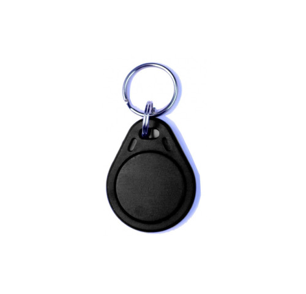

# Čipy pro přístupový systém

## Stav dokumentu

Pracovní podklad k první agendě přístupového systému. Údaje vycházejí z požadavků výboru a z produktové stránky dodané dne 2026-05-08.

Obrázek je uložen lokálně pro pracovní analýzu. Před veřejným publikováním na webu SVJ je vhodné ověřit, zda lze produktový obrázek použít tímto způsobem, případně použít odkaz nebo podklady výslovně poskytnuté dodavatelem.

## Přehled položky

| Kód položky | Název pro formulář | Cena pro agendu SVJ | Popis | Obrázek | Zdroj |
|---|---|---:|---|---|---|
| `rfid-klicenka-cerna` | Černá RFID klíčenka | 44 Kč / ks | RFID klíčenka 125 kHz, základní plastová, černá | [rfid-klicenka-cerna.jpg](assets/cipy/rfid-klicenka-cerna.jpg) | [Jabloshop produkt](https://www.jabloshop.cz/plastova-rfid-klicenka-standard-cerna) |

## Pravidla použití ve formuláři

- Formulář pracuje s počtem objednaných čipů za jednotku.
- Počet čipů musí být kladné celé číslo.
- Hodnota 0 čipů je chyba.
- Každý objednaný čip se platí samostatně cenou 44 Kč za kus.
- Cena čipů se započítá do společného doplatku spolu se zvolenou variantou telefonu.

## Náhled

